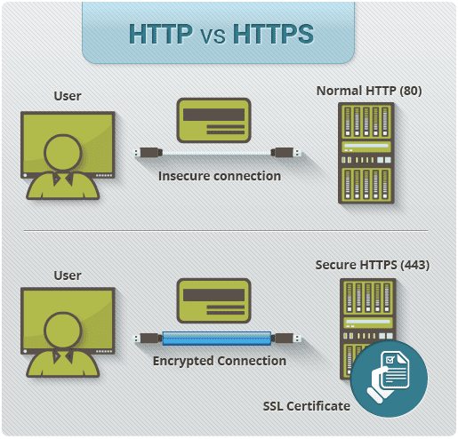

# What are application protocols.

- Rules that apps follows to communicate across the internet.
- Application protocols matters in cybersecurity because attacks often happen at this layer.

  - SQL injection hits web apps.
  - DNS Spoofing targets DNS Protocols.
  - SMTP spoofing abuses email protocols.
  - HTTP Vulnerabilities leads to XSS, CSRF etc...
 
## 1. HTTP & HTTPS

- **HTTP** stands for hypertext transfer protocol.
- Its used for web browsing - transferring HTML, CSS, JS, API's, Images etc...
- **HTTPS** is a combination of **HTTP** + **TLS**

### How it works?

- Client browser sends:

  > GET /index.html HTTP/1.1

- Server responds with status code:

  > 200 OK, 404 Not Found, 500 Internal Error

- Data transfers as plain text (HTTP) or encrypted (HTTPS)

### Common Attacks

- MITM (Man In The Middle) on HTTP
- Cookie Hijacking
- XSS
- CSRF

## 2. DNS

- **DNS** stands for Domain Name System.
- converts domains like google.com to its IP Address.
- If someone controls DNS they can redirect you anywhere.

### How it works

- Your system asks the DNS server: **"What is the IP for google.com"**
- Resolver checks the cache ➡️ Root ➡️ TLD ➡️ Authorative server.
- Returns the IP: **"142.250.192.68"**

### Common attacks

- DNS Spoofing
- DNS Cache poisoning
- DNS Tunneling
- DNS Amplification

## 3. SMTP

- **SMTP** stands for Simple Mail Transfer Protocol
- It uses ports 25, 587, and 465.
- It is used for exchanging email messages between servers.
- To send a mail the client opens a TCP connection to the SMTP server. The server which is always listening on port 25 initiates the connection as soon as it detects a client.  Once the TCP connection is established, the client sends the email across the connection.

- 
