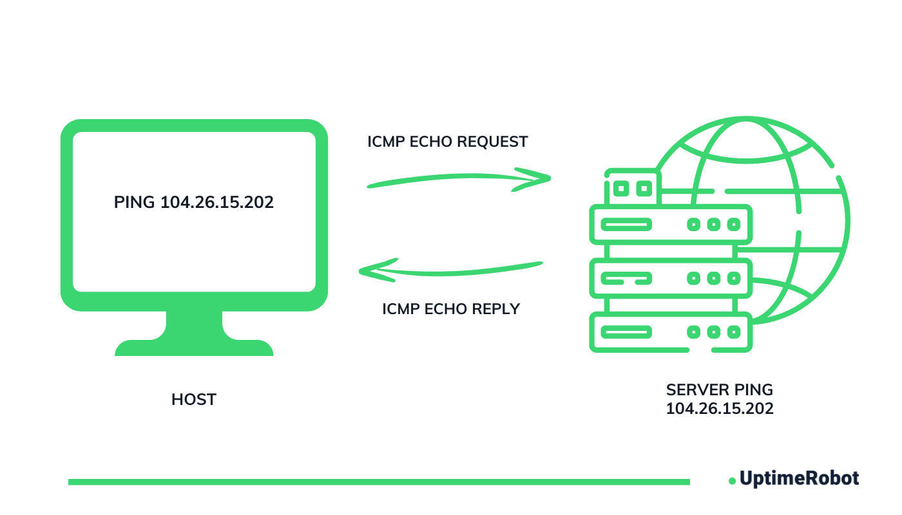

# What is ICMP

- **ICMP** Stands for Internet Control Message Protocol.
- It is the networks "Messanger or error detector"
- What **ICMP** actually does:

  - Reports problems
  - Checks connectivity
  - Sends more messages
  - Used for diagnostics
 
  
