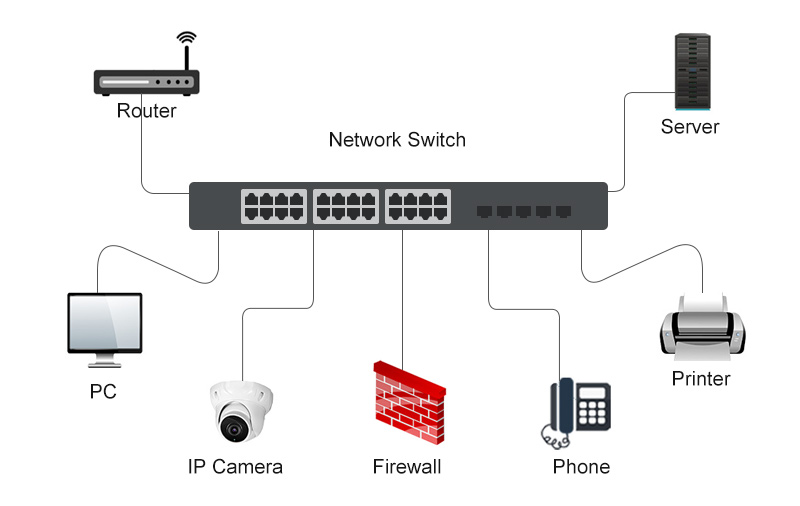

# 1. HUB - The dumbest device (Layer 1)

- Operates at OSI Layer 1
- Takes an electrical signal on one port and broadcast it to every other ports.
- No MAC table, No intelligence, No filtering. Its literally a multi port repeater.

**Functionality**

- Every device connected shares the same collision domain.
- If one device sends, everyone hears it.

**Security impact**

- Very Insecure
- Because it broadcasts all traffic to every port, an attacker can easily sniff packets with tools like Wireshark.

# 2. SWITCH - The smartest middleman (Layer 2)

- Operates at OSI Layer 2
- Uses MAC address table to forward frames only to the connected port.

**Functionality**

- MAC Learning: Learn source MAC from the incomming frames and builds a table.
- Forwarding / Filtering: Forwards based on destination MAC rather than broadcasting.
- Segmentation: Each port is its own collision domain.

## Security Roles:

Switches are the backbone of the LAN security.

**VLANS**: 

- Seperates sensitive networks. (HR, Servers, IoT devices, Guest WiFi)
- Limits lateral movements during attacks.

**Port Security**:

- Restrict which MAC address can use a port.
- Prevent rogue devices from connecting.

## Weakness

- MAC flooding attacks can overflow a switch table → forces it to broadcast like a hub.
- Needs proper configuration; misconfigurations easily weaken security.

# 3. Router

