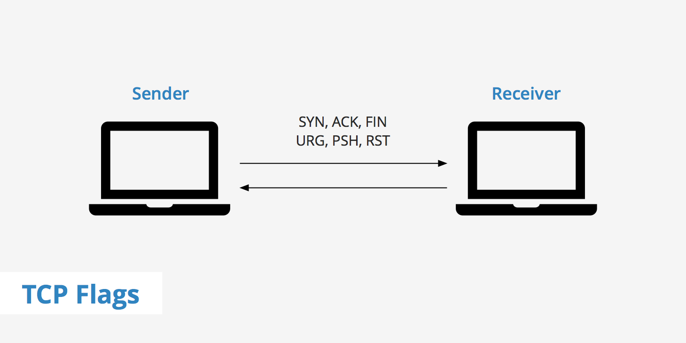

# What is TCP

- **TCP** stands for Transmission Control Protocol.
- **TCP** works in layer 3 in **TCP/IP** & layer 4 in **OSI** model.
- **TCP** ensures:  

  - No data loss.
  - Packet arrive in correct order.
  - Retransmission happens if something is missing.
  - Connection-based communication.

## How TCP atually starts.

- **TCP** uses the **3 way handshake**:

  1. **Client** ➡️ **Server**: SYN (I want to connect)
  1. **Server** ➡️ **Client**: SYN-ACK (I'm Ready)
  1. **Client** ➡️ **Server**: SYN (Lets go)  

> Connection is created and data transmission begins

## What is TCP good for:

Anything where acuracy matters like:

- Web browsing (HTTP/HTTPS)
- File Transfer (FTP, SFTP)
- Email (SMTP/IMAP)
- SSH
- Database Communication

## What are TCP Flags

- **TCP Flags** are single bit indicators inside the TCP header.
- Each flag is either 0's (off) & 1's (on).
- When "on", they signal a specific type of operation in the connection cycle.
- There are 8 main TCP Flags.

### 1. SYN (Synchronize)

Used to start a connection.

- This is basically the **"Hey I want to connect signal"**
- Use in the 3-way handshake.

### 2. ACK (Acknowledgment)

Acknowledges recieved data.

- Means **"Yes, I got your data/flag"**.
- Almost every packet after the handshake has this flag set.

### 3. FIN (Finish)

Used to end a connection polietly.

- This is the **"I'm done sending data"** signal.
- Leads to a 4-step termination process.

  - **Step-1**: Client sends FIN flag to signal it has no more data to send.
  - **Step-2**: Server sends ACK flag acknowledging the FIN from the client.
  - **Step-3**: Server sends FIN flag when server is ready to close connection.
  - **Step-4**: Client sends ACK when client recieves the FIN flag from server to confirm the connection is now fully closed to both sides. 
 
### 4. RST (Reset)

Kills the connection immediately.

- Its like **"Stop Everything. Now"**
- send when an error or unexpected condition occurs.

### 5. URG (Urgent)

Indicates that certain data in packet is urgent.

- Its rarely used now a days.
- Old-school flag for immediate attention.

## cybersecurity relevance

